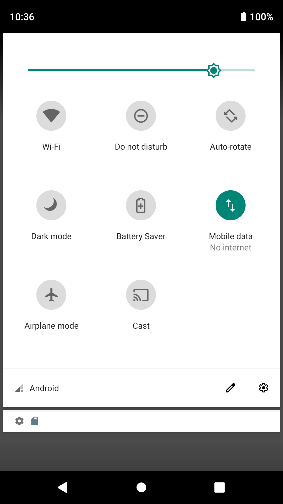
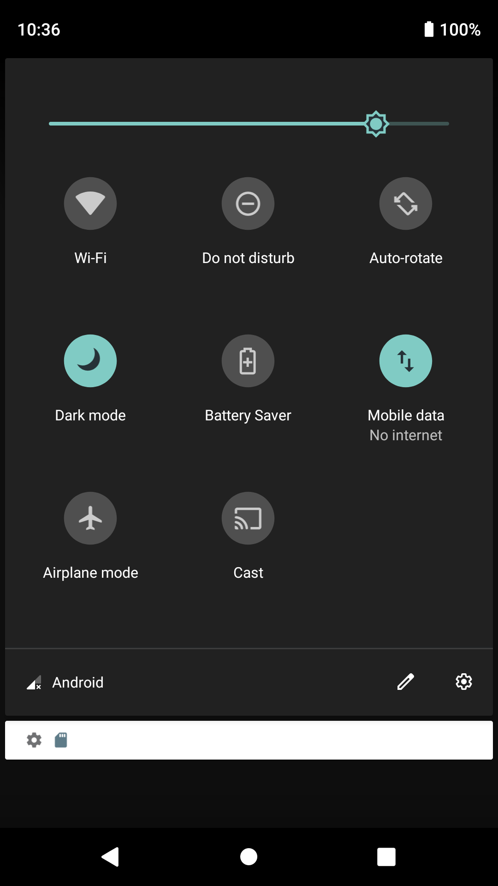

# Dark mode

 - System-wide dark mode toggle for Android versions 4.1 through 9.0
 - Offers quick settings tile on Android 7.0 and above
 
## Downloads

 - [Direct APK Download](https://github.com/Andrew67/dark-mode-toggle/releases/download/v1.0-beta1/dark-mode-toggle-1.0-beta1.apk)
 - Google Play (coming soon)
 - F-Droid (planned)

## Screenshots

### Quick Settings Tile

## License
 - [MIT License](./LICENSE)
 - &copy; 2020 Andrés Cordero
 - Copyright 2019 @ Shubham Tyagi
