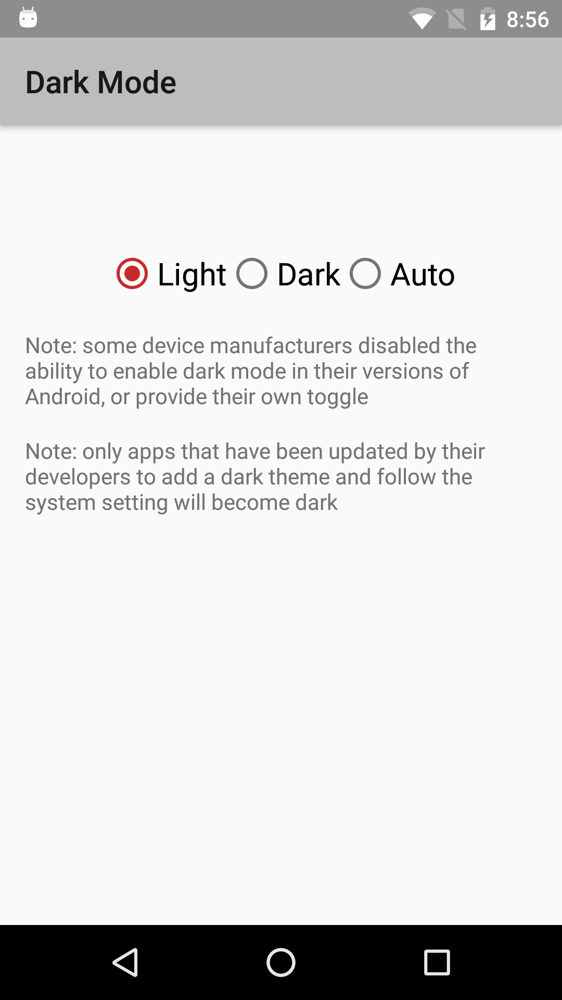
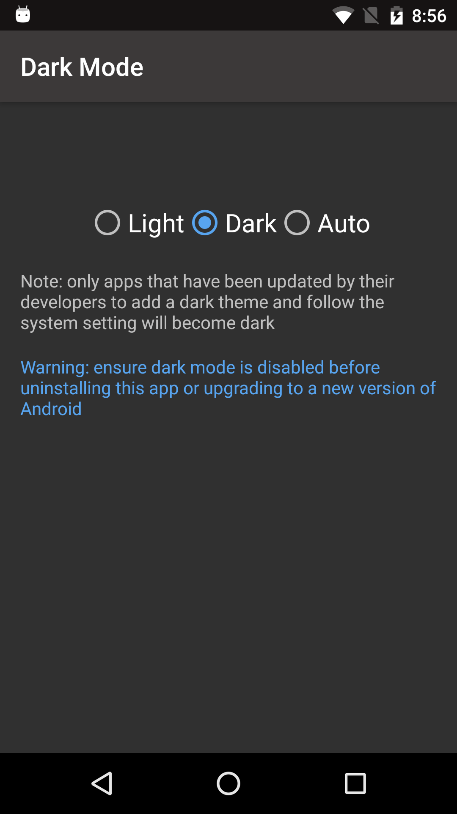

# Dark Mode

 - System-wide dark mode toggle for Android versions 4.1 through 9.0
 - Offers quick settings tile on Android 7.0 and above
 
## Downloads

 - [APK from Github](https://github.com/Andrew67/dark-mode-toggle/releases/download/v1.0-beta2/dark-mode-toggle-1.0-beta2.apk)

## Screenshots

### Quick Settings Tile

 

### In-App Toggle

 

## Privacy Policy

 - This app does not collect or transmit any user or device information, ever
 - This website is hosted by GitHub (see their [Privacy Policy](https://help.github.com/en/github/site-policy/github-privacy-statement))
 - If you downloaded the app from Google Play, their [Privacy Policy](https://policies.google.com/privacy) also applies
 - Thank you Google Play users! 100K+ downloads from 2020 to 2023

## License

 - [MIT License](./LICENSE)
 - &copy; 2020 Andrés Cordero
 - Copyright 2019 @ Shubham Tyagi
